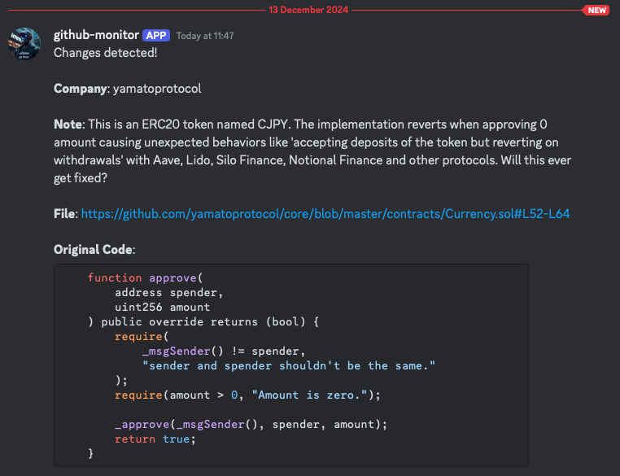

# Code Snippets Monitor

A simple tool for security researchers to monitor code-changes that silently fix bugs or introduce new ones, across multiple repositories.

# Table of Contents
- [Features](#features)
- [Installation](#installation)
- [Basic usage](#basic-usage)
- [Configuration](#configuration)
- [Using a cron job to run the tool periodically](#using-a-cron-job-to-run-the-tool-periodically)
- [Discord notifications](#discord-notifications)
- [How it works](#how-it-works)
- [Practical examples](#practical-examples)

## Features

- Runs periodically
- Monitor code snippets from files hosted on GitHub
- Supports adding notes to every monitored code snippet for context
- Discord webhook integration for receiving notifications on changes
- Customize the avatar, username, and message-template for your Discord notifications





## Installation

### Using: go install

Make sure you have Go installed on your system (version 1.16 or higher recommended), then run:

Clone the repository and build manually:

```bash
git clone https://github.com/infosec-us-team/csm.git
cd csm
go build
```

The binary will be saved in the current directory.

You can run the tool with:
```bash
./csm --help
```

## Basic Usage

The tool supports three main operations: adding code snippets to monitor, removing them, and checking for changes.

### Adding a code snippet

Example usage:
```bash
csm --add "https://github.com/company/repo/blob/main/file.js#L52-L64" --note "Monitoring API endpoint configuration"
```

#### Parameters

- `--add` (required): A GitHub URL pointing to a line range in a file. **Must meet these requirements**:
  - Must be a valid GitHub URL pointing to a specific file
  - Must include line numbers in the format `#L{start}-L{end}` (e.g., `#L52-L64`)
  - Example:
    ```bash
    csm
    --add "https://github.com/yamatoprotocol/core/blob/master/contracts/Currency.sol#L52-L64"
    ```

- `--note` (optional): A descriptive note about what is being monitored
  - Will be included in Discord notifications when changes are detected
  - Example:
    ```bash
    csm
    --add "https://github.com/yamatoprotocol/core/blob/master/contracts/Currency.sol#L52-L64"
    --note "This is an ERC20 token named CJPY. The implementation reverts when approving 0 amount causing unexpected behaviors like 'accepting deposits of the token but reverting on withdrawals' with Aave, Lido, Silo Finance, Notional Finance and other protocols. Will this ever get fixed?"
    ```

### Removing a code snippet

Example usage:
```bash
csm --remove "https://github.com/company/repo/blob/main/file.js#L52-L64"
```

#### Parameters

- `--remove` (required): The same GitHub URL that was initially added, including the line range.

### Checking for changes in all code snippets

Example usage:
```bash
csm --webhook "https://discord.com/api/webhooks/your-webhook-url"
```

#### Parameters

- `--webhook` (required): The Discord Webhook URL to receive notifications.

## Configuration

You can customize the `username`, `avatar`, and `template` for the Discord notifications by tweaking the `config.json` file. 

It also contains every saved `code snippet`, `url`, `company` and `note`.

```json
{
  "snippets": [
    {
      "url": "https://github.com/company/repo/blob/main/file.js#L52-L64",
      "company": "company",
      "content": ["line1", "line2", "line3"],
      "note": "Monitoring API endpoint configuration"
    }
  ],
  "discord": {
    "template": "Changes detected!\n\n**Company**: {{.Company}}\n{{if .Note}}\n**Note**: {{.Note}}\n{{end}}\n**File**: {{.URL}}\n\n**Original Code**:\n```javascript\n{{.Content}}\n```",
    "username": "GitHub Monitor",
    "avatar_url": "https://i.ibb.co/JH5GnN3/Unknown-8.jpg"
  }
}
```

Set `discord.template` to an empty string "" if you want to use the default template.

## Using a cron job to run the tool periodically

Open crontab:
```bash
crontab -e
```

Add a job:
```bash
0 0 * * * /path/to/csm --webhook "https://discord.com/api/webhooks/your-webhook-url"
```

This runs the tool daily at midnight.

Ensure the tool has execution permissions:

```bash
chmod +x /path/to/csm
```

## Discord Notifications

When changes are detected, the tool sends a notification to Discord with:
- The company/organization name
- The monitored file URL
- The original code snippet
- The custom notes added

## How It Works

1. **URL parsing**: The tool converts GitHub web URLs to raw content URLs and extracts line numbers.
2. **Content fetching**: It retrieves the code snippet from the specified lines.
> Important: If the monitored text appears multiple times in the same file, alerts won’t trigger unless it’s modified everywhere. Therefore, select a sufficiently unique snippet, typically 3 to 7 lines, to ensure it appears only once in the file.
3. **Change detection**: The tool checks if the file contains the original code snippet.
4. **Notification**: If it does not, it sends a formatted message to the specified Discord webhook.
5. **Auto-remove code snippets**: If a change was detected, the tool removes the old code snippet from the list after sending the notification so that it doesn't trigger another notification every day for the same old code snippet.


## Practical Examples

Two examples of how to use the tool:
- Monitoring changes that could introduce bugs
- Monitoring bug fixes

### Monitoring changes that could introduce bugs

Let's see an example with Moonbeam Network.

#### Moonbeam Network, Substrate and FRAME

**Moonbeam** is a Parachain built using Substrate.

Substrate nodes contain business logic for executing transactions, saving state transitions, and interacting with the outer node in the **Runtime**.

Runtimes can be composed by **FRAME pallets**, which enables you to create custom logic using predefined components as a starting point.

#### The problem

Runtime misconfigurations are not uncommon, and updating which pallets are in the runtime often introduces vulnerabilities.

But manually reading every pull request looking for changes to *the set of pallets in the runtime of the main network* is unfeasible or impossible depending on how many Parachains you are trying to keep track of.

#### Solution

First, we extract the code from line 1398 to 1489 of the `lib.rs` file from the Moonbeam repository, which contains the collection of pallets used in the Moonbeam runtime.
```bash
csm --add "https://github.com/moonbeam-foundation/moonbeam/blob/master/runtime/moonbeam/src/lib.rs#L1398-L1489"
```

At the time of writing, the URL points to a code snippet that looks like this:

```rust
construct_runtime! {
  pub enum Runtime
  {
    // System support stuff.
    System: frame_system::{Pallet, Call, Storage, Config<T>, Event<T>} = 0,
    ParachainSystem: cumulus_pallet_parachain_system::{Pallet, Call, Storage, Inherent, Event<T>} = 1,
        // .......................... MORE CODE HERE ..........................
        // .......................... MORE CODE HERE ..........................
        // .......................... MORE CODE HERE ..........................
    // Randomness
    Randomness: pallet_randomness::{Pallet, Call, Storage, Event<T>, Inherent} = 120,
  }
}
```

Run the `Code Snippets Monitor` with a cron job to receive a notification when anything changes in the runtime constructor.

### Monitoring bug fixes

#### Yamato Protocol

Yamato Protocol offers a stable coin named **CJPY**.

The implementation reverts when approving a 0 amount, which may cause unexpected behaviors like '*accepting deposits of the token but reverting on withdrawals*' with Aave, Lido, Silo Finance, Notional Finance and other protocols.

Will this ever get fixed?

#### Monitoring bug fixes

First, we extract the code from line 52 to 62 of the `Currency.sol` file from the repository and start monitoring it.
```bash
csm --add "https://github.com/yamatoprotocol/core/blob/master/contracts/Currency.sol#L52-L64"
```

At the time of writing, the URL points to:

```javascript
    function approve(
        address spender,
        uint256 amount
    ) public override returns (bool) {
        require(
            _msgSender() != spender,
            "sender and spender shouldn't be the same."
        );
        require(amount > 0, "Amount is zero.");

        _approve(_msgSender(), spender, amount);
        return true;
    }
```

Run the `Code Snippets Monitor` with a cron job to receive a notification when anything changes in this function.